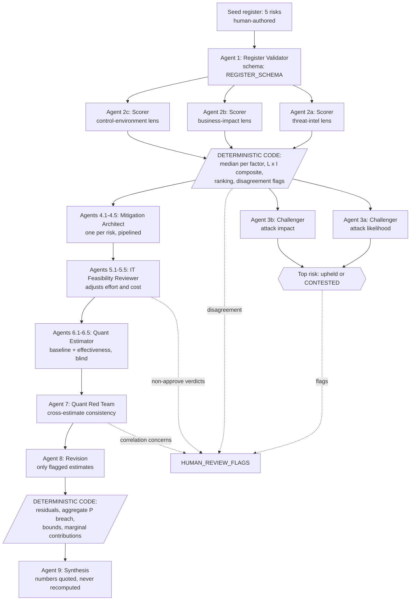

# Risk Prioritization with Agentic AI

**Scenario (fixed):** a 200-employee SaaS company on Azure + M365 — public-facing web app, PostgreSQL backend, remote workforce, one small IT team, SOC 2 in progress. Added assumptions are itemized in [ASSUMPTIONS.md](ASSUMPTIONS.md).

**What this is:** a working multi-agent pipeline (not a single prompt) that takes a 5-risk register through validation → 3-lens scoring → adversarial challenge → mitigation + feasibility review → quantitative breach-likelihood modeling → synthesis. **24 agents** in the executed run; every agent returns schema-validated JSON; **all arithmetic is done by deterministic code, never by a model**. The pipeline was actually executed — the outputs in [outputs/](outputs/) are its real artifacts, and [workflow/risk_pipeline.workflow.js](workflow/risk_pipeline.workflow.js) is the exact script that ran. A second 7-agent pass then **web-verified every parameter against current primary sources** and adversarially assessed this deliverable itself ([SOURCES.md](SOURCES.md)).

```
repo layout
├── README.md                     ← this write-up (results included below)
├── ASSUMPTIONS.md                ← every stated assumption, and why it matters
├── SOURCES.md                    ← research-verified citations + the v1.1 recalibration
├── HUMAN_REVIEW_FLAGS.md         ← auto-generated: where NOT to trust the AI (+ post-research status)
├── ROADMAP.md                    ← sequencing waves, KRIs, MITRE ATT&CK + SOC 2 evidence matrix
├── dashboard.html                ← self-contained results dashboard (artifact fragment; see provenance note inside)
├── workflow/
│   ├── risk_pipeline.workflow.js ← the executed orchestration script (the plumbing, untouched)
│   ├── replay_harness.mjs        ← node shim: re-runs the script from saved outputs; PASS = byte-identical
│   └── advanced_analytics.py     ← seeded Monte Carlo, tornado, ROSI, framework sensitivity
├── prompts/                      ← exact prompt templates for all 9 agent roles
├── schemas/schemas.json          ← JSON Schemas that force structured agent output
└── outputs/                      ← real artifacts: 01-07 pipeline run, 08 analytics, 09 research findings
```

---

## Task 1 — The five risks

Each entry names a **threat source**, the **asset at stake**, and the **exposure** (why this company, specifically). The seed register was authored by hand; a validator agent then tightened wording and checked distinctness without being allowed to change ids or subjects. The table below **is** the validated register ([outputs/01_risk_register.json](outputs/01_risk_register.json)) — not the seed draft — so it matches the artifact it links to.

| ID | Risk | Threat source | Asset at stake | Exposure |
|----|------|---------------|----------------|----------|
| **R1** | AiTM credential phishing → M365/Entra account takeover | External financially motivated phishing crews using adversary-in-the-middle kits (Evilginx-class) that proxy the real Entra login page and steal session cookies, defeating Authenticator push MFA | Employee Entra ID identities and everything behind them: Exchange Online mail, SharePoint/OneDrive tenant data, and the ~15 downstream SSO SaaS apps, including any admin roles they carry | 200 remote employees; MFA is phishable push with no Conditional Access device-compliance or authentication-strength policies; a 3-person IT team with no SIEM cannot triage sign-in anomalies at scale |
| **R2** | Public web app exploitation (SQLi/IDOR/CVE) → PostgreSQL customer-data exfiltration | External opportunistic mass scanners and targeted attackers exploiting OWASP-class flaws (SQLi, IDOR, SSRF) or unpatched framework/library CVEs in the internet-facing multi-tenant app | Business records and PII of ~500k end users across ~1,200 customer orgs in Azure Database for PostgreSQL, plus the app-layer tenant-isolation boundary | Internet-facing App Service with no WAF; no dedicated security engineer to drive secure-SDLC gates or rapid patching; a single application flaw can cross tenant boundaries in the shared database |
| **R3** | Leaked CI/CD & cloud secrets → Azure production subscription compromise | External attackers harvesting live secrets from repository history, infostealer-compromised developer laptops (GitHub PATs, cached tokens), or malicious/compromised GitHub Actions dependencies | The single production Azure subscription: App Service, PostgreSQL connection credentials, Blob Storage including backups, and the GitHub Actions pipeline that deploys to it | Historical .env files and connection strings committed to private repos; long-lived service-principal secrets with Contributor rights in GitHub Actions; ~60 engineers whose access multiplies leak paths; no dedicated security staff monitoring for secret exposure |
| **R4** | Ransomware/extortion via unmanaged remote endpoints | Ransomware affiliates and initial-access brokers delivering infostealers and loaders through malvertising, trojanized installers, and commodity phishing aimed at remote workers' laptops | Employee laptops, cached corporate credentials and Entra tokens, locally synced OneDrive/SharePoint data, and continuity of support, billing, and engineering operations | ~40% of laptops not Intune-enrolled; users commonly local admins; Defender AV on defaults with no EDR and no SIEM, so nobody is watching alerts; remote-first workforce mixes personal use with work devices |
| **R5** | Offboarding gaps: dormant employee/contractor access to production data | Departed or departing employees and contractors retaining valid credentials (malicious or negligent), and external attackers credential-stuffing dormant accounts that no one is watching | Production PostgreSQL (direct contractor database accounts), GitHub source code, and customer data reachable via lingering M365/Entra and downstream SaaS access; credibility of the in-progress SOC 2 program | Offboarding is manual and ticket-driven across Entra, ~15 SSO apps, Azure, GitHub, and direct Postgres accounts; contractors hold standing database logins outside SSO, so a missed ticket leaves working production access indefinitely |

The five have deliberately distinct threat sources (external-phishing, external-appsec, external-secrets, external-malware, internal) and distinct primary assets, so mitigations don't collapse into one another.

---

## Task 2 — The agentic workflow

### Architecture



### Why this is agentic rather than one prompt

1. **Separation of estimation and computation.** Models only ever produce *parameters with justifications*; composites, rankings, residuals and aggregates come from ~40 lines of auditable JavaScript in the orchestration script. You can recompute every number in this report by hand from the JSON outputs.
2. **Independence where it buys signal.** The three scorers can't see each other; the five quant estimators can't see each other. Convergence is evidence, divergence becomes a human-review flag instead of being averaged away.
3. **Opposed incentives.** Generator/critic pairs at every consequential step: architect vs. feasibility reviewer, estimators vs. red team, ranking vs. adversarial challengers who are explicitly permitted to return "upheld" so they don't manufacture objections.
4. **Schema-forced output.** Every agent (except the prose synthesizer) returns JSON validated against a schema ([schemas/schemas.json](schemas/schemas.json)), with automatic retry on mismatch. No regex-parsing of model text anywhere.
5. **Auditability as a data structure.** The scoring panel must justify *every factor score* in 1–2 falsifiable sentences. The full trail — 3 lenses × 5 risks × 4 factors, with reasons — is preserved in [outputs/02_prioritization_scores.json](outputs/02_prioritization_scores.json).

### Prioritization framework (FAIR-lite ordinal)

- **Likelihood** decomposed FAIR-style into **TEF** (threat-event frequency, 1–5) and **VULN** (susceptibility given current controls, 1–5) — separating "how often is this tried" from "how often does a try succeed here."
- **Impact** decomposed into **PRIMARY** (direct: IR, downtime, recovery) and **SECONDARY** (notification, churn, fines, SOC 2 setback), both on dollar-banded 1–5 scales calibrated to a ~$20M ARR company.
- **Composite** = `L × I`, with `L = (TEF+VULN)/2`, `I = 0.6·PRIMARY + 0.4·SECONDARY`; medians across the three lenses; tiers Critical ≥16, High ≥10, Medium ≥5.
- Full scale definitions: [prompts/00_shared_context.md](prompts/00_shared_context.md). Design rationale (median vs. mean, the 60/40 weight as a policy choice): [ASSUMPTIONS.md](ASSUMPTIONS.md).

### The run

24 agents, ~706k tokens, ~12 minutes wall clock. The validator tightened all five entries and — usefully — **stripped seven asserted "facts" across three entries** that my drafts had invented beyond the scenario (e.g. "no secret scanning", "shared service accounts", "single high-privilege DB role"), moving them to `validation_notes` as things to confirm in fieldwork (they're also listed in [ASSUMPTIONS.md](ASSUMPTIONS.md) so the documents agree). It also flagged 3 coverage gaps for the watchlist (backup immutability/restore testing, third-party SaaS vendor breach, *current*-insider overexposure).

**Reproducibility:** [workflow/replay_harness.mjs](workflow/replay_harness.mjs) re-executes the exact pipeline script with `agent()` mocked to return the saved outputs — all deterministic code paths run for real. Result: `PASS — replayed ranking, scoring table, model, final estimates and top-risk verdict are byte-identical to the shipped outputs/` (`node workflow/replay_harness.mjs` to verify yourself).

**Priority ranking** (composite = L × I, median of 3 lenses; full factor-level audit trail with every scorer's reasoning in [outputs/02_prioritization_scores.json](outputs/02_prioritization_scores.json)):

| Rank | Risk | Likelihood | Impact | Composite | Tier |
|------|------|-----------|--------|-----------|------|
| **1** | **R3 — Leaked CI/CD & cloud secrets → Azure subscription compromise** | 4.0 | 4.4 | **17.6** | **Critical** |
| 2 | R1 — AiTM phishing → M365 account takeover | 4.5 | 3.4 | 15.3 | High |
| 3 | R2 — Web app exploitation → PostgreSQL exfiltration | 4.0 | 3.8 | 15.2 | High |
| 4 | R4 — Ransomware via unmanaged endpoints | 3.5 | 3.6 | 12.6 | High |
| 5 | R5 — Offboarding gaps / dormant access | 3.5 | 3.4 | 11.9 | High |

No factor had a scorer spread ≥ 2, so no scoring-disagreement flags fired — three genuinely different lenses converged on this ordering.

**The single highest risk: R3.** Why, in one paragraph from the audit trail: it is the only risk where all three lenses scored *both* impact factors at or near the maximum — a Contributor-level service principal in a **single** production subscription reaches the database, the backups, and the deploy pipeline at once (no recovery path), while likelihood is held up by commodity infostealers hitting an unmanaged, local-admin developer fleet whose repos contain historical connection strings.

**Adversarial challenge:** split verdict, so the #1 stands but carries a flag. The *likelihood* challenger **refuted** (medium confidence, alternative: R1), arguing a genuine methodological catch — two scorers' TEF counted raw delivery attempts while their VULN also counted chain-success, double-counting the chain, and one TEF contributor (public-repo scanning) can't apply to private repos. The *impact* challenger **upheld** (high confidence): R3 *is* the existential scenario — multi-tenant breach, backup destruction and subscription persistence are all inside it. Both arguments, with cited evidence, are in [outputs/03_top_risk_and_challenge.json](outputs/03_top_risk_and_challenge.json). A human adjudicating the dissent should note R1 vs R3 are within 2.3 composite points and R1's mitigation turns out to have the *largest marginal effect on breach likelihood* (below) — the correct executive read is "R3 and R1 are the top tier; fund both."

**How robust is the ranking itself?** Two policy choices in the framework (the 60/40 impact weight, median-vs-mean lens aggregation) were stress-tested in code ([outputs/08_advanced_analytics.json](outputs/08_advanced_analytics.json) → `framework_sensitivity`): **R3 stays #1 across the entire primary-weight sweep 0.50–0.70 and under mean aggregation** — the answer to "the single highest risk" does not depend on the knobs. What *does* move is the R1/R2 pair: they swap at weights ≤ 0.55 and sit 0.1 composite points apart, so the pipeline now flags them as a **statistical tie** — an honest ranking says when its own ordering is noise.

---

## Task 3 — Mitigations (control · owner · effort)

Each package was designed by a mitigation-architect agent against the factor-level scoring rationale, then re-priced by an IT-feasibility agent role-playing the 3-person IT team. **All five came back `approve_with_changes`** — the reviewer consistently found the architects optimistic (effort up ~40–50%, hidden licensing traps like the GitHub Enterprise SSO requirement) — which is exactly why the pipeline has that stage. The table shows the **feasibility-adjusted** numbers; full packages (all controls with types, quick wins, residual gaps, SOC 2 mappings, both effort estimates) are in [outputs/04_mitigations.json](outputs/04_mitigations.json).

| Risk | Primary control (named) | Owner | Adjusted effort | Annual cost (adj.) | SOC 2 |
|------|------------------------|-------|-----------------|--------------------|-------|
| **R3** | GitHub Actions **OIDC workload-identity federation to Entra ID** — delete all long-lived service-principal secrets; + GitHub Secret Protection (push protection, history triage), Key Vault, least-privilege RBAC, immutable backups | Head of Engineering (IT Manager co-owner) | L · ~13 pw | $15k–32k | CC6.1–6.3, 6.6, 7.1–7.2, 7.4, 8.1, A1.2 |
| **R1** | **Phishing-resistant MFA (passkeys/FIDO2)** enforced tenant-wide via Entra Conditional Access **authentication strengths**; FIDO2 hardware keys for admins/finance | IT Manager | L · ~12 pw | $40k–58k yr-1 (E5 Security add-on shared with R4) | CC6.1, 6.6–6.7, 7.2–7.4 |
| **R2** | **Azure WAF** (App Gateway WAF v2 / Front Door Premium, Prevention mode) + CodeQL/Dependabot gates + least-privilege DB role and **PostgreSQL row-level security** retrofit + annual pen test | Head of Engineering (IT executes WAF/logging) | L · ~18 pw | $45k–75k yr-1 | CC6.1, 6.6, 7.1–7.2, 7.4, 8.1 |
| **R4** | Entra **Conditional Access compliant-device gating** (forces Intune to ~100%) + **Defender for Business EDR** with automated investigation + local-admin removal via LAPS/EPM | IT Manager (CTO signs enforcement dates) | L · ~12 pw | $12k–22k | CC6.1, 6.6, 6.8, 7.2, 7.4–7.5 |
| **R5** | **Entra ID as the single revocation point**: Entra auth on PostgreSQL Flexible Server (kill standing local DB logins), SCIM provisioning for priority SaaS, automated leaver workflow, quarterly access reviews | IT Manager (Head of Eng co-owner for Postgres) | L · ~9 pw | $10k–30k | CC6.1–6.3, 7.2, 9.2 |

Two cross-cutting outputs worth more than any single row: every package ships **quick wins executable in under a week** (28 total — e.g. revoke the historical `.env` secrets *today*, reconcile the contractor Postgres roster, enable free GitHub push protection), and the feasibility reviewers produced a coherent **sequencing plan**: R1's identity work and R4's device gating share one Conditional Access change window; R5's Phase-1 contractor cleanup jumps the queue because it's days of work closing a live hole.

---

## Task 4 — Quantified breach-likelihood reduction

**The model** (all arithmetic by code in the workflow script — the LLMs only supplied parameters with written bases):

```
residual_i      = baseline_i × (1 − effectiveness_i)            (mode values)
P(≥1 breach)    = 1 − Π(1 − p_i)                                 (independence assumed — see caveat)
bounds:           best  = low baseline × high effectiveness
                  worst = high baseline × low effectiveness
marginal_i      = P_baseline − P(only mitigation i applied)
```

Five estimator agents (blind to each other) produced baseline and effectiveness estimates with named industry anchors; a red-team agent then reviewed the *set* and forced a revision of R5 (baseline mode raised 8% → 10% for consistency with R4's panel score; effectiveness decomposed and cut 65% → 57% because pre-departure exfiltration is untouched by leaver automation). Raw estimates, red-team issues, and the revision change-log are all preserved in [outputs/05_quantification.json](outputs/05_quantification.json).

**Per-risk parameters and residuals** (annual probability of a *material* incident — IR cost > $25k or a notification duty):

| Risk | Baseline (low/mode/high) | Mitigation effectiveness | Residual (low/mode/high) | Reduction (mode, pp) |
|------|--------------------------|--------------------------|--------------------------|-----------------------|
| R3 | 8% / **20%** / 40% | 45% / **70%** / 85% | 1.2% / **6.0%** / 22% | −14.0 |
| R1 | 15% / **30%** / 55% | 60% / **80%** / 92% | 1.2% / **6.0%** / 22% | −24.0 |
| R2 | 8% / **20%** / 40% | 45% / **65%** / 80% | 1.6% / **7.0%** / 22% | −13.0 |
| R4 | 8% / **15%** / 30% | 45% / **65%** / 80% | 1.6% / **5.25%** / 16.5% | −9.75 |
| R5 | 3% / **10%** / 22% | 40% / **57%** / 72% | 0.84% / **4.3%** / 13.2% | −5.7 |

**Aggregate change** (the headline number, with its warning label attached):

| | Baseline | Residual | Change |
|--|----------|----------|--------|
| P(≥1 material breach in 12 mo), mode | **65.7%** | **25.5%** | **−40.2 pp (−61.2% relative)** |
| Scenario bounds (best/worst) | 35.8% – 91.2% | 6.3% – 65.6% | — |

**Marginal contribution** — what each mitigation buys *alone* against the full baseline (this, not the risk ranking, is what should drive sequencing):

| Mitigation applied alone | Aggregate P(breach) | Δ vs baseline |
|--------------------------|--------------------:|---------------:|
| R1 — phishing-resistant MFA | 54.0% | **−11.7 pp** ← largest single lever |
| R3 — OIDC + secret hygiene | 59.7% | −6.0 pp |
| R2 — WAF + SDLC + RLS | 60.2% | −5.5 pp |
| R4 — device gating + EDR | 61.8% | −3.9 pp |
| R5 — single revocation point | 63.6% | −2.1 pp |

Note the deliberate tension the pipeline surfaced: R3 is the top-*ranked* risk (impact-driven), but R1 is the biggest single *likelihood* lever. Priorities aren't the same question as sequencing — the model makes that explicit instead of hiding it in one number.

**Caveats the pipeline itself raised** (not added by me afterwards): the independence assumption **overstates the baseline aggregate** — the red team identified one infostealer infection on the unmanaged fleet as a shared driver of R3 *and* R4, and phishable MFA as a shared driver of R1, R3 and R5, so the true baseline is somewhat below 65.7% and correlated *mitigation under-delivery* (one overloaded 3-person team implementing all five packages) makes the residual optimistic. It also flagged that all five baselines lean on the same unstated assumption that PII access near-automatically triggers notification duty. Directionally the reduction is robust; the point estimates are not — which is why the parameters were then research-verified (next section).

### Research validation → the v1.1 calibrated model

The flags demanded human verification of every parameter, so a second agentic pass (6 web-research verifiers, raw findings in [outputs/09_research_validation.json](outputs/09_research_validation.json)) checked each baseline, effectiveness value, impact band and price against **current primary sources** — Verizon DBIR 2026, GitGuardian State of Secrets Sprawl 2026, Sophos State of Ransomware 2025, Proofpoint ATO data, NetDiligence 2025 claims, Picus Blue Report 2025, Microsoft/GitHub pricing pages (fetched 2026-07-06). Verdicts and the row-by-row recalibration are in [SOURCES.md](SOURCES.md); highlights:

- **Confirmed:** R1's baseline (Proofpoint: 62% of orgs had a successful ATO; 65% of compromised accounts had MFA on) and its 80% effectiveness (Google's 350k-attempt security-key study); R4's baseline (DBIR 2026: ransomware in 48% of breaches, 96% of victims SMBs); the impact bands (NetDiligence: BI-involved SME ransomware averages $2.1M).
- **Recalibrated down:** R2 and R3 baselines (the DBIR exploitation surge is edge/VPN-driven, not custom SaaS apps; secret *exposure* ≈ certain but the full chain prices lower) and R5 (survey rates are lifetime, not annual — external data overrode the internal red team's raise, and both moves are preserved in the audit trail). R2's effectiveness trimmed (stock WAF managed rules ≈ 60% precision), R4's and R5's high-modes capped.

| | v1.0 (pipeline) | **v1.1 (research-calibrated)** |
|--|-----------------|-------------------------------|
| Aggregate baseline (mode) | 65.7% | **56.7%** |
| Aggregate residual (mode) | 25.5% | **20.5%** |
| Reduction | −40.2 pp (−61.2%) | **−36.2 pp (−63.9%)** |
| Biggest marginal lever | R1 −11.7 pp | **R1 −14.8 pp** |

The v1.1 baseline lands inside the ceiling the internal red team argued for — the external evidence and the internal skeptic **converged independently**, which is the strongest calibration signal this exercise produced. Both models ship side by side in [outputs/08_advanced_analytics.json](outputs/08_advanced_analytics.json); v1.0 remains untouched as the as-run artifact.

### Uncertainty, sensitivity, and money ([workflow/advanced_analytics.py](workflow/advanced_analytics.py) — seeded, deterministic, no LLM)

- **Monte Carlo (100k iterations, triangular distributions).** v1.1: reduction is **38.2 pp median (P5–P95: 32.0–45.1)**; P(residual ≤ 35%) = 93%. A *correlated* variant (shared threat-environment and execution-capacity shocks, pairwise rank corr ≈ 0.4 — implementing the red team's concern) widens the residual band to **17.7–39.9%** without changing the median: the reduction survives correlation, the precision doesn't.
- **Tornado (one-way sensitivity).** The aggregate residual is most sensitive to **R2's baseline** (±10.1 pp swing in v1.1), then R1's effectiveness — so the two cheapest ways to improve this model are a real external attack-surface scan (pins R2) and passkey-rollout coverage telemetry (pins R1). That is where a human should spend verification effort first.
- **Expected annual loss / ROSI** (impact-band midpoints × probabilities vs. year-1 cost incl. labor at $3k/person-week): v1.1 portfolio EAL falls from **$1.69M to $0.53M** for ~$362k of year-1 spend — **portfolio ROSI = 221%**, positive for every mitigation (R3 best at 424%, R5 weakest at 13% — R5 is justified by SOC 2 evidence value and tail risk, not ROI, and the model says so honestly).

---

## Where the AI must not be trusted without human review

Auto-generated from agent flags during the run — see [HUMAN_REVIEW_FLAGS.md](HUMAN_REVIEW_FLAGS.md) for the full list **and its post-research status table**: the research pass worked most flags (parameters verified/recalibrated, prices confirmed against vendor pages, SOC 2 mappings audited), while two remain genuinely open — the notification-duty materiality assumption (needs counsel, not research) and the structural risk that one 3-person team under-delivers all five packages at once. The standing rule survives in weakened form: **v1.1's numbers are research-anchored but AI-gathered — a human should click through the ~30 cited sources, and company telemetry validation is still outstanding.**

The run produced **23 auto-collected flags + 9 red-team issues**, grouped by source:

- **Quantitative parameters (highest distrust).** All five estimators self-flagged `human_review_required: true` — baselines and effectiveness numbers are anchored to DBIR/IBM-style patterns *from model memory* and must be checked against current editions. The red team added a joint-calibration concern: the five baselines together imply a ~65% annual incident probability, on the high side of SMB base rates.
- **Ranking dissent.** One of two challengers refuted R3's #1 spot (alternative R1, medium confidence) on a real methodological point (TEF/VULN conditioning). A human should adjudicate — the pipeline surfaced the argument rather than silently resolving it.
- **Cost/licensing.** Every feasibility review found pricing traps (GitHub Enterprise for SSO ≈ +$15k/yr, E5 Security vs. standalone Entra P2 trade-offs). All prices are model-memory estimates; get real quotes.
- **Cross-package dependencies.** The red team caught R3's and R5's estimates assuming *contradictory states of the same control* (Postgres Entra-auth deferred vs. completed) — the single best demonstration in this run of why blind parallel estimates need a set-level review.
- **Known pipeline limitation (honest disclosure).** Red-team issues tagged to a single risk trigger automatic revision (R5's was); issues spanning risks (`R3+R5`, `ALL`) don't map to one reviser and are deliberately left as human flags rather than auto-resolved.

---

## Beyond the brief — features that make this operationally useful

- **Research-verified parameters (v1.1).** A second agentic pass fact-checked every number against DBIR 2026, GitGuardian 2026, Sophos 2025, NetDiligence 2025 and live vendor pricing pages, producing a cited source register ([SOURCES.md](SOURCES.md)) and a recalibrated model — the worked example of exactly the human review the flags demanded.
- **Reproducibility harness.** `node workflow/replay_harness.mjs` re-runs the real orchestration script against the saved agent outputs and byte-diffs the results — the "plumbing" is provable, not just readable.
- **Uncertainty, sensitivity, and money.** Seeded Monte Carlo (independent *and* correlated), tornado analysis telling a human where verification effort pays off most, and per-mitigation ROSI for the budget conversation ([outputs/08](outputs/08_advanced_analytics.json)).
- **Implementation roadmap with KRIs.** Three waves consolidated from the feasibility reviews, a 30/60/90 cut, and per-risk key-risk-indicators with named Azure/M365 data sources and targets — how the company *knows* risk is falling ([ROADMAP.md](ROADMAP.md)).
- **Framework mappings, audited.** MITRE ATT&CK v19.1 kill chains per risk (all 22 technique IDs verified against live pages) and a SOC 2 evidence matrix checked against the AICPA TSC text — two miss-mapped criteria dropped, two gaps added ([ROADMAP.md](ROADMAP.md)).
- **SOC 2 dual-use.** Every mitigation is mapped to Trust Services Criteria — the company is mid-audit, so risk spend doubles as audit evidence.
- **Marginal-contribution analysis.** The model computes what each mitigation buys *alone* (`delta_pp_vs_baseline`), which is what actually drives sequencing under a 3-person IT team — not raw risk scores.
- **Re-runnable by design.** The workflow accepts an updated register via `args.risks` — re-run quarterly or after a control lands, and diff the outputs.
- **Coverage-gap watchlist** (risks *not* in the top 5) and **human-review flags as a first-class artifact**, both machine-generated from the run.
- **Everything is a file.** Registers, scores, mitigations, model parameters, research findings — all JSON, trivially importable into a GRC tool or the next run.

## Pipeline changelog — upgrades specified for the next run

The as-executed script is kept untouched as the audit artifact; these v1.1 pipeline changes are specified for the next quarterly run, each fixing something this run surfaced:

1. **Portfolio-reconciliation stage** after the red team: fix one canonical control timeline (e.g., "Postgres Entra-auth lands in month X") and a double-counting rule, then re-trigger targeted revisions — closes the gap where multi-risk issues (`R3+R5`, `ALL`) currently map to no reviser.
2. **Near-tie flag in the ranking code** (adjacent composites < 0.5 apart → "treat as tied"), promoted from post-hoc analytics into the pipeline output.
3. **TEF/VULN conditioning guard** in the scorer prompt (score TEF on *delivery attempts only*, VULN on *attempt→success only*) — the exact double-count the likelihood challenger caught.
4. **Research-verifier stage as a standing phase** (the 6 web agents from this upgrade), so parameters arrive cited instead of being flagged for later.

## Reproducing / porting

The orchestration runs on the Claude Agent SDK's workflow harness (`agent()` spawns a subagent, `schema:` forces validated JSON, `parallel()`/`pipeline()` control concurrency). `workflow/replay_harness.mjs` shows the full harness contract in ~40 lines of shims — implementing those five functions on LangGraph (nodes = agents, edges = the phase graph, code nodes = the deterministic steps) or CrewAI ports the design 1:1; the prompts and schemas are stack-agnostic. The analytics need only Python 3 stdlib; the replay harness needs Node ≥ 18.

**Time spent:** the core assessment (register + framework design ~1h, pipeline authoring and debugging ~1.5h, run + write-up ~1h) fits the 3–4h box. The upgrade layer — research verification, v1.1 recalibration, Monte Carlo/ROSI analytics, roadmap/KRIs, replay harness, dashboard — was built **after and outside that box** (~2h of additional orchestration) and is labeled as such rather than squeezed into the claim.
